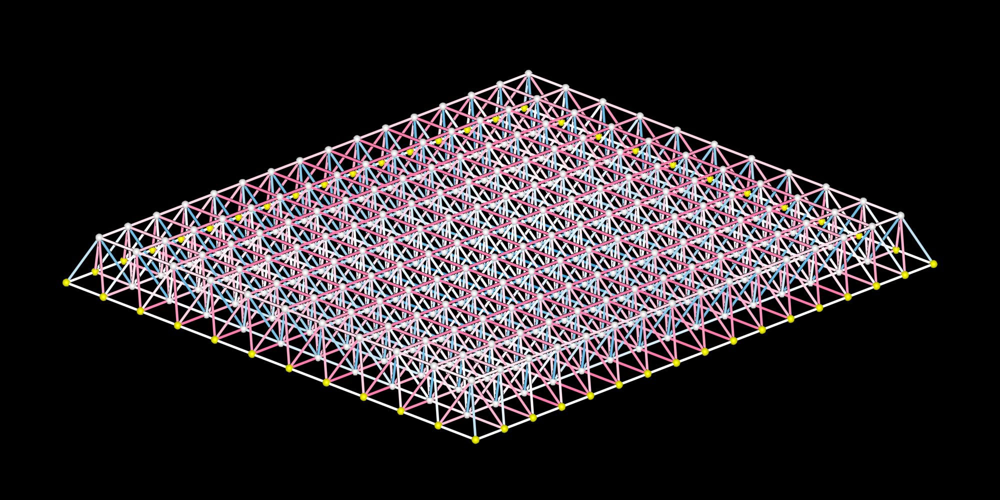
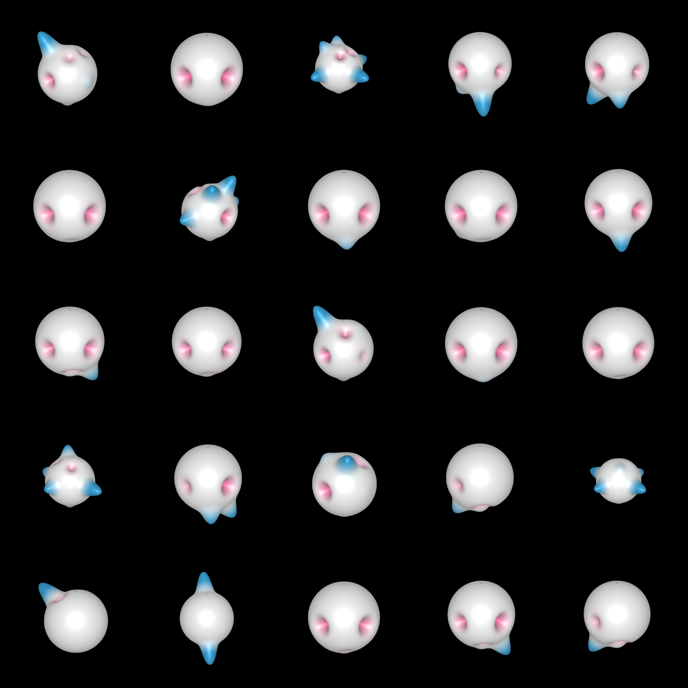
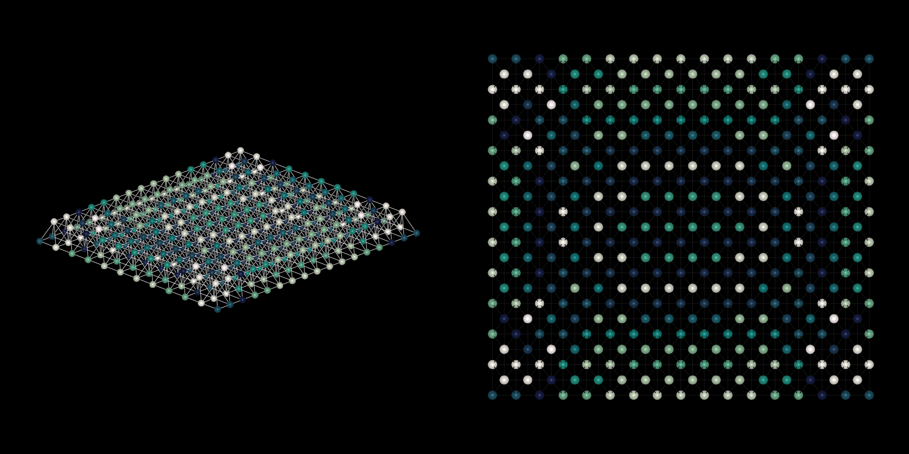

# AsapHarmonics
Lightweight implementation of the [Node Harmonic shape descriptor](https://link.springer.com/article/10.1007/s44150-022-00021-4). Relies on the [aSAP.jl](https://github.com/keithjlee/Asap) framework.

Given an analyzed `TrussModel`, a node force demand analysis can be performed via:
```julia
harmonic_analysis = HarmonicAnalysis(model; delta = 20, dims = 16)
```
Where:
- `delta` is the shape factor for the Gaussian force function representation of nodal force demands (see paper). Each spherical "bump" that represents an axial load approaches a Dirac delta function as delta approaches infinity.
- `dims` is the dimension of the feature vector that represents nodal force demands.

The representative feature vectors of nodal demands can be extracted from `HarmonicAnalysis.featurevecture`. This can form the basis of clustering/rationalization of truss connections.





