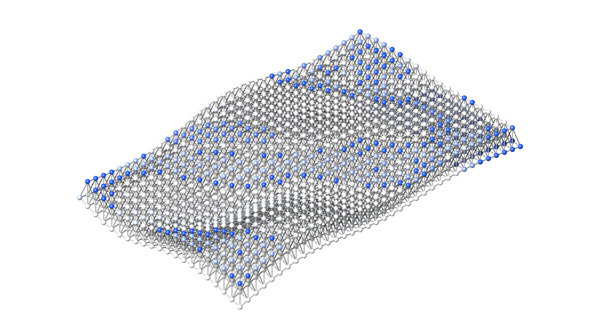
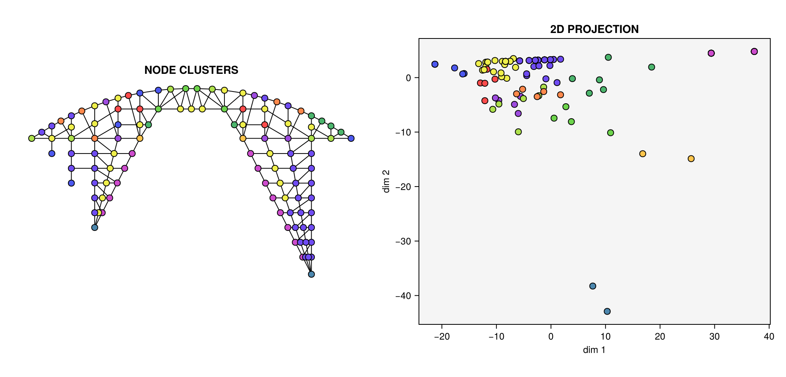
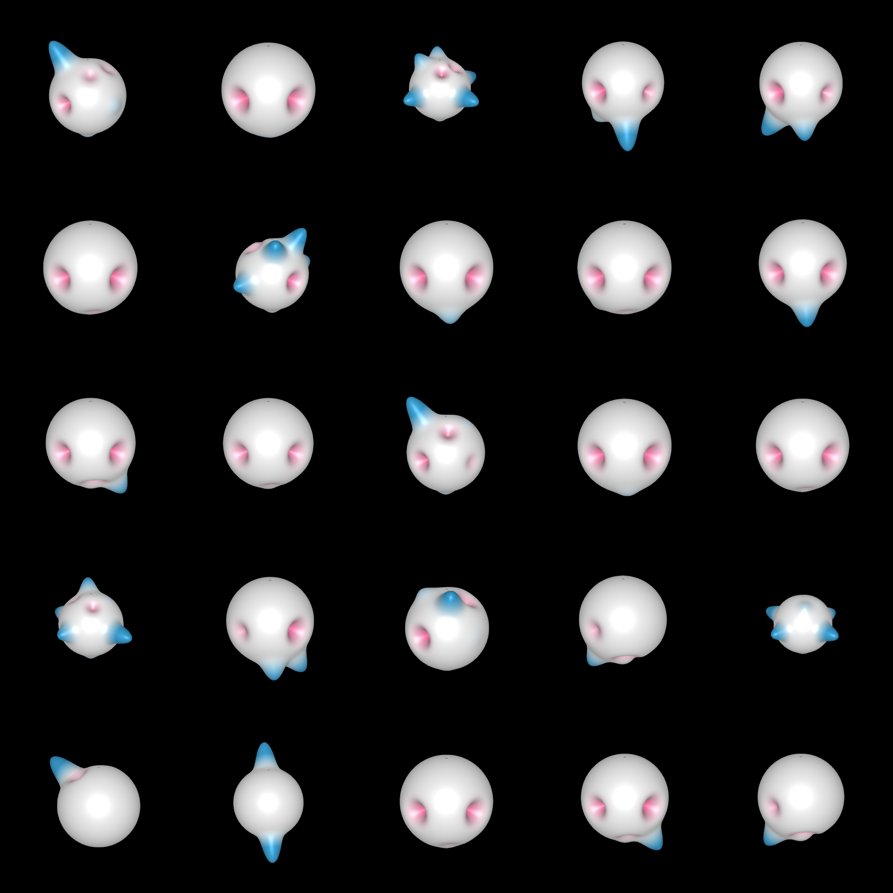

# AsapHarmonics.jl

Rotation-invariant **shape descriptors of nodal force demands** in truss
structures, built on [Asap.jl](https://github.com/keithjlee/Asap). Each node's
force demands — member axial forces, applied loads, support reactions — are
represented as a sum of Gaussian bumps on the unit sphere (3D) or circle (2D);
the descriptor is the energy spectrum of that signature's spherical-harmonic
(3D) or Fourier (2D) expansion, **computed in closed form** from force
directions and magnitudes alone. The feature vectors support node-similarity
analysis, design-complexity scoring, connection standardization by clustering,
and — because the whole pipeline is smooth — **gradient-based optimization of
structures for connection repeatability** via
[AsapOptim](https://github.com/keithjlee/AsapOptim).

Provenance:

- The 3D method is the implementation of **Lee, Danhaive & Mueller (2022)**
  [[1]](#references) (`resources/LeeDanhaiveMueller2022.pdf`).
- The 2D Fourier formulation is based on **chapter 4 of the author's
  dissertation** (`resources/kjl_dissertation_chapter4.pdf`); see
  [`examples/salginatobel.jl`](examples/salginatobel.jl), which reproduces its
  figure suite.

## Quick start

```julia
using Asap, AsapHarmonics

# ... build and solve! an Asap Model ...

ha = HarmonicAnalysis(model; delta = 20, dims = 16)   # 3D (spherical harmonics)
# ha = HarmonicAnalysis2d(model; delta = 0.1, dims = 16) # planar (Fourier)

ha.featurevectors        # rotation-invariant descriptor per node
distance_matrix(ha)      # pairwise nodal dissimilarity
complexity(ha)           # design complexity: minimal bounding-sphere radius
soft_complexity(ha)      # smooth surrogate (for optimization)

using Clustering         # activates the clustering extension
km = cluster_nodes(ha, 10)               # k-means connection groups
cluster_complexities(ha, km.assignments) # residual standardization penalty

using MultivariateStats  # activates the MDS extension
embed_nodes(ha)          # 2D demand-space projection
```

Differentiable design optimization (see [`examples/optimization.jl`](examples/optimization.jl)):

```julia
using AsapOptim, Zygote

p  = OptParams(model, variables)
hp = harmonic_params(p; delta = 20, dims = 16)

obj(x) = soft_complexity(x, p, hp)     # smooth in the design vector
g = Zygote.gradient(obj, x0)[1]        # or ForwardDiff.gradient
```

`delta` is the sharpness of the Gaussian force bumps (each bump approaches a
Dirac spike as `delta → ∞`); `dims` is the descriptor length. See
[`examples/`](examples/) for complete walkthroughs with figures.



## Mathematical background

The descriptors are computed analytically, not by sampling and transforming.
This section derives the closed forms so they can be verified against the
cited sources.

### 1. Force signatures

At a node with forces of signed magnitude $f_i$ (members: tension-positive
axial force at the outward unit direction $\hat{n}_i$; applied loads and
reactions: $|P|$ at $\hat{P}$), the **spherical force signature** is the sum
of Gaussian bumps measured by squared *chord* distance on the unit sphere
$S^2$:

$$f(\hat{x}) = \sum_i f_i\, e^{-\delta \lVert \hat{x} - \hat{n}_i \rVert^2},
\qquad \hat{x} \in S^2 .$$

This is the deterministic force-to-shape conversion of [1], which adapts the
spherical harmonic shape descriptor of Kazhdan, Funkhouser & Rusinkiewicz [2]
to structural force demands. The 2D analog for planar trusses uses Gaussian
bumps in geodesic (arc) angle on the circle,

$$s(\theta) = \sum_i f_i\, e^{-(\theta - \theta_i)^2 / 2\sigma^2},$$

following the planar Fourier shape descriptors of Zahn & Roskies [3].

### 2. The kernel is a von Mises–Fisher zonal function

For unit vectors, $\lVert \hat{x} - \hat{n} \rVert^2 = 2 - 2\,\hat{x} \cdot \hat{n}$,
so each bump is exactly

$$e^{-\delta \lVert \hat{x} - \hat{n} \rVert^2}
  = e^{-\kappa}\, e^{\kappa\, \hat{x} \cdot \hat{n}},
\qquad \kappa = 2\delta .$$

The factor $e^{\kappa \hat{x}\cdot\hat{n}}$ is the kernel of the von
Mises–Fisher distribution on the sphere (Fisher [4]; Mardia & Jupp [5]) — a
**zonal** function: it depends on $\hat{x}$ only through $\hat{x} \cdot \hat{n}$.
Zonal kernels are exactly the class with closed-form spherical-harmonic
expansions.

### 3. Closed-form expansion (Gegenbauer + Funk–Hecke)

The Gegenbauer plane-wave-type expansion (DLMF §10.60.7 [6]; Abramowitz &
Stegun §10.2 [7]) gives

$$e^{\kappa t} = \sum_{l=0}^{\infty} (2l+1)\, i_l(\kappa)\, P_l(t),$$

where $P_l$ are Legendre polynomials and $i_l$ the modified spherical Bessel
functions of the first kind. Equivalently — and this is the Funk–Hecke
theorem (Funk [8], Hecke [9]; modern treatments in Müller [10] and Atkinson &
Han [11]) applied to our kernel — a single bump of weight $f_i$ at
$\hat{n}_i$ has real orthonormal spherical-harmonic coefficients

$$a_{lm} = f_i\, \lambda_l\, Y_{lm}(\hat{n}_i),
\qquad
\lambda_l = 2\pi \int_{-1}^{1} e^{-\kappa} e^{\kappa t} P_l(t)\, dt
          = 4\pi\, e^{-\kappa}\, i_l(\kappa).$$

Numerically, $e^{-\kappa} i_l(\kappa) = \sqrt{\pi/2\kappa}\;
\mathrm{besselix}(l + \tfrac12, \kappa)$ (a scaled Bessel evaluation, no
overflow for large $\kappa$). In the package: `zonal_coefficients`.

### 4. Rotation-invariant feature vector (addition theorem)

By linearity, the full signature has $a_{lm} = \lambda_l \sum_i f_i\,
Y_{lm}(\hat{n}_i)$. The descriptor component of degree $l$ is the $L^2$ norm
of the degree-$l$ band, and the **addition theorem** (Atkinson & Han [11]),

$$\sum_{m=-l}^{l} Y_{lm}(\hat{x})\, Y_{lm}(\hat{y})
  = \frac{2l+1}{4\pi}\, P_l(\hat{x} \cdot \hat{y}),$$

collapses it to pairwise Legendre sums over the force directions:

$$\boxed{\;
\mathrm{FV}_l^2 = \sum_{m=-l}^{l} a_{lm}^2
  = \lambda_l^2\, \frac{2l+1}{4\pi}
    \sum_{i,j} f_i f_j\, P_l(\hat{n}_i \cdot \hat{n}_j)
\;}$$

No grids, no quadrature, no transform: $O(n^2 \cdot l_{\max})$ per node with
$n$ the node valence. In the package: `spherical_feature_vector`, with
`pairwise_legendre_sums` evaluating all degrees in one recurrence pass.

### 5. The 2D analog (wrapped Gaussian)

On the circle, the geodesic Gaussian bump coincides (up to a truncation error
of order $e^{-\pi^2/2\sigma^2}$, i.e. $\sim 10^{-215}$ at $\sigma = 0.1$) with
the **wrapped Gaussian**, whose Fourier coefficients are exactly
$c_k = \tfrac{\sigma}{\sqrt{2\pi}} e^{-\sigma^2 k^2 / 2}$ (Mardia & Jupp [5]).
Hence

$$\hat{s}_k = c_k \sum_i f_i e^{-\mathrm{i} k \theta_i},
\qquad
\boxed{\;
\mathrm{FV}_k = |\hat{s}_k|
  = \frac{\sigma}{\sqrt{2\pi}}\, e^{-\sigma^2 k^2/2}
    \sqrt{\textstyle\sum_{i,j} f_i f_j \cos k(\theta_i - \theta_j)}
\;}$$

In the package: `circular_feature_vector`.

### 6. Properties

- **Exact rotation invariance**: a rotation of the direction set only mixes
  coefficients within each degree (3D) or shifts Fourier phases (2D); band
  energies are unchanged. This holds exactly, not approximately — the
  angle-coordinate kernel written in [1] is only approximately zonal near the
  poles, whereas the chord-distance kernel implemented here is exactly zonal.
- **Scaling**: $\mathrm{FV}(cf) = |c|\,\mathrm{FV}(f)$; **polarity**:
  $\mathrm{FV}(-f) = \mathrm{FV}(f)$; invariant to force ordering.
- **Smoothness**: $\mathrm{FV}$ is smooth in both magnitudes and directions —
  the basis for gradient-based complexity optimization.
- **The $l = 1$ (and $k = 1$) component of a complete signature is the
  equilibrium residual**: $\mathrm{FV}_1 \propto \lVert \sum_i f_i \hat{n}_i \rVert$,
  which vanishes at every equilibrated node. It carries no design information.
- **Relation to the sampled implementation**: the packaged sampled path
  (`sampled_force_function` on the `sph_points` grid + `sph_transform`, or
  `circular_gaussian` + `rfft`) reproduces the closed forms to machine
  precision and exists only for cross-validation and visualization. An `rfft`
  of an $n$-point sampled circular signature returns $\approx n \cdot \mathrm{FV}_k$.

### 7. Downstream metrics

Dissimilarity between nodes is $\lVert \mathrm{FV}_1 - \mathrm{FV}_2 \rVert_2$
(`distance_matrix`); the **design complexity** of [1] is the radius of the
minimal bounding hypersphere of all nodal feature vectors (`complexity`, exact
Welzl algorithm [12]); k-means clustering of feature vectors groups nodes for
connection standardization with per-cluster residual radii
(`cluster_complexities`). The bounding-sphere radius is a minimax and not
smooth, so `soft_complexity` — the RMS distance of feature vectors from their
centroid, bounded by twice the exact radius — serves as the differentiable
objective.

## References

1. K. J. Lee, R. Danhaive, C. T. Mueller. *Spherical harmonic shape
   descriptors of nodal force demands for quantifying spatial truss
   connection complexity.* Architecture, Structures and Construction 2 (2022).
   [doi:10.1007/s44150-022-00021-4](https://doi.org/10.1007/s44150-022-00021-4)
2. M. Kazhdan, T. Funkhouser, S. Rusinkiewicz. *Rotation invariant spherical
   harmonic representation of 3D shape descriptors.* Symposium on Geometry
   Processing (2003).
3. C. T. Zahn, R. Z. Roskies. *Fourier descriptors for plane closed curves.*
   IEEE Transactions on Computers C-21(3) (1972).
4. R. A. Fisher. *Dispersion on a sphere.* Proceedings of the Royal Society
   of London A 217 (1953).
5. K. V. Mardia, P. E. Jupp. *Directional Statistics.* Wiley (2000).
6. NIST Digital Library of Mathematical Functions, §10.60 (eq. 10.60.7).
   https://dlmf.nist.gov/10.60
7. M. Abramowitz, I. A. Stegun. *Handbook of Mathematical Functions*, §10.2.
   Dover (1964).
8. P. Funk. *Beiträge zur Theorie der Kugelfunktionen.* Mathematische
   Annalen 77 (1916).
9. E. Hecke. *Über orthogonal-invariante Integralgleichungen.* Mathematische
   Annalen 78 (1918).
10. C. Müller. *Spherical Harmonics.* Lecture Notes in Mathematics 17,
    Springer (1966).
11. K. Atkinson, W. Han. *Spherical Harmonics and Approximations on the Unit
    Sphere: An Introduction.* Lecture Notes in Mathematics 2044, Springer
    (2012).
12. E. Welzl. *Smallest enclosing disks (balls and ellipsoids).* New Results
    and New Trends in Computer Science, LNCS 555, Springer (1991).


