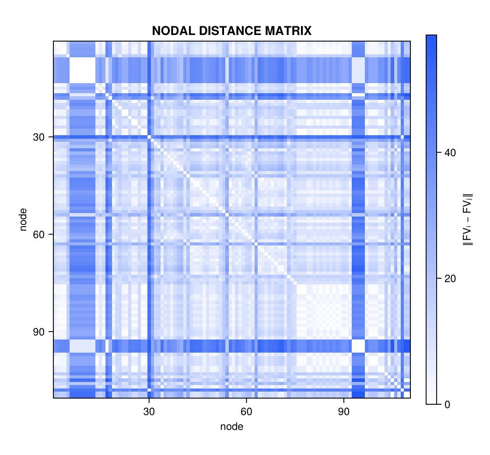
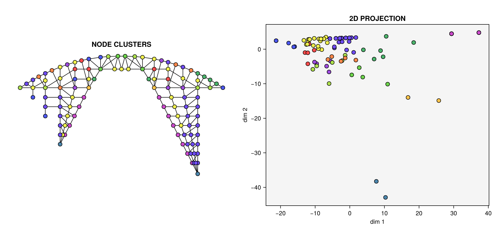

# Distances, complexity, clustering

Once every node is a feature vector, engineering questions become geometry
in descriptor space: *how different are two connections?* (distance), *how
varied are this design's demands overall?* (complexity), *how few connection
designs could cover the whole structure?* (clustering). This page walks
through that analysis layer on one model.

```@setup ana
using Random
Random.seed!(1)
```

```@example ana
using Asap, AsapHarmonics
using LinearAlgebra, Statistics

section = Section(Material(200e6, 1.0, 80.0, 0.3), 1e-3)
sf = SpaceFrame(6, 1.0, 6, 1.0, 1.0, (u, v) -> 1.5 * sinpi(u) * sinpi(v), section;
    support = :corner, load = [0.0, 0.0, -20.0])
model = sf.model
solve!(model)

ha = HarmonicAnalysis(model; delta = 20, dims = 16)
F = feature_matrix(ha)   # dims × n_nodes matrix view of the descriptors
size(F)
```

## Nodal dissimilarity: the distance matrix

The dissimilarity between two nodes is the Euclidean distance between their
feature vectors — eq. 7 of Lee, Danhaive & Mueller (2022). Because the
descriptors are rotation-invariant, this compares demand *shapes*: a node
whose demand pattern is a rigid rotation of another's is at distance zero.

```@example ana
D = distance_matrix(ha)
println("most similar pair of distinct nodes: ",
    Tuple(argmin(D + I * Inf)), "; most dissimilar: ", Tuple(argmax(D)))
```

The distance matrix is the input to everything downstream — clustering,
embedding, and complexity all measure structure in this metric. For the
Salginatobel bridge walkthrough (`examples/salginatobel.jl`) the matrix
itself is already informative — repeated demand patterns show up as blocks:



## Design complexity

The **design complexity** of a structure (eq. 8 of the paper) is the radius
of the minimal bounding hypersphere of all its nodal feature vectors: the
size of the smallest "demand envelope" containing every connection. Uniform
structures — all nodes alike — score near zero however large they are;
every distinct demand pattern inflates the envelope.

```@example ana
c = complexity(ha)
```

[`bounding_sphere`](@ref) computes the underlying sphere exactly (in-package
Welzl move-to-front algorithm), returning its center and radius:

```@example ana
bs = bounding_sphere(ha.featurevectors)
round(bs.radius, digits = 4)
```

A minimax radius is not smooth — the gradient lives entirely on whichever
point currently touches the sphere — so for optimization the package
provides [`soft_complexity`](@ref): the RMS distance of the feature vectors
from their centroid. It is smooth everywhere, scales linearly with force
magnitudes, and is bounded by twice the exact radius:

```@example ana
s = soft_complexity(ha)
println("complexity = ", round(c, digits = 3), "; soft complexity = ",
    round(s, digits = 3), " (bound: soft ≤ 2·exact = ", round(2c, digits = 3), ")")
```

## Connection standardization by clustering

In practice one rarely fabricates a distinct connection per node — nodes are
grouped and each group gets one standardized design. K-means clustering of
the feature vectors finds those groups directly in demand space.
[`cluster_nodes`](@ref) activates when Clustering.jl is loaded (a package
extension):

```@example ana
using Clustering

k = 5
km = cluster_nodes(ha, k)
[count(==(c), km.assignments) for c in 1:k]   # nodes per group
```

How good is a standardization? [`cluster_complexities`](@ref) gives each
cluster's *residual* bounding radius — the demand variation a single shared
design must still absorb. Small radii mean the group is honest; one large
radius flags a group that should be split:

```@example ana
round.(cluster_complexities(ha, km.assignments), digits = 3)
```

Sweeping `k` trades number of distinct designs against residual complexity —
the paper's standardization curve. The smooth counterpart
[`soft_cluster_complexities`](@ref) (per-cluster RMS from the cluster
centroid) supports the same measure inside gradient-based optimization,
where [`cluster_projector`](@ref) precomputes the block-averaging operator
for fixed assignments (see
[Differentiable optimization](optimization.md#Clustered-objectives)).

On the Salginatobel truss, clustered feature vectors map directly back onto
the structure as connection groups:



## Demand-space maps: MDS embedding

For inspection, the (dims-dimensional) descriptor cloud can be projected to
the plane by classical multidimensional scaling, best preserving the
distance matrix — the "demand space" plots of the paper.
[`embed_nodes`](@ref) activates when MultivariateStats.jl is loaded:

```@example ana
using MultivariateStats

E = embed_nodes(ha; maxoutdim = 2)   # 2 × n_nodes coordinates
size(E)
```

Nodes that plot close together have similar demands and are candidates for a
shared connection; cluster memberships drawn in this plane make the k-means
groups visually checkable. Two caveats when reading MDS plots:

- Coordinates are meaningful only up to rotation, reflection, and
  translation — axes have no engineering meaning.
- Two *separately computed* embeddings cannot be overlaid point-to-point.
  To compare designs (e.g. before/after optimization), pool both feature
  vector sets and embed them **jointly**:
  `embed_nodes(vcat(ha0.featurevectors, ha1.featurevectors))` — see
  `examples/optimization.jl`.

Next: making complexity a differentiable function of the design, in
[Differentiable optimization](optimization.md).
