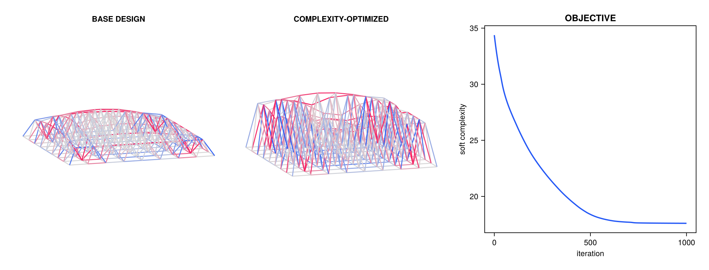
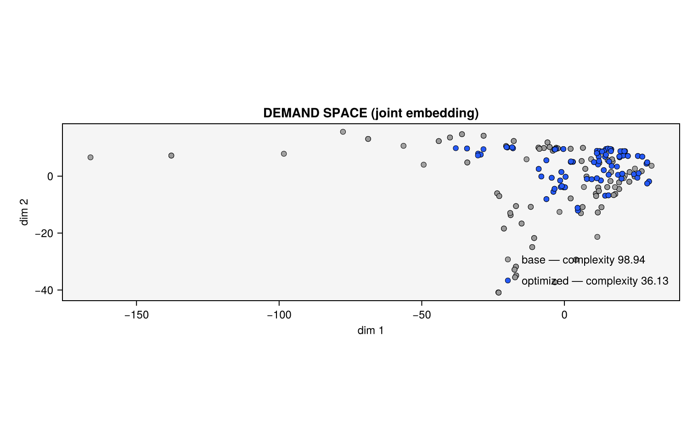

# Differentiable optimization

The closed-form descriptors are smooth in force magnitudes *and* directions,
and Asap/AsapOptim make the structural solve differentiable — so **design
complexity is a differentiable function of the design variables**, and a
structure's shape can be optimized to make its nodal demands more uniform:
fewer unique connection designs for the same topology. The chain, every link
smooth:

```
design vector x → solve → axial forces → signatures → feature vectors → soft complexity
```

This page follows `examples/optimization.jl` at documentation scale. The
functions used here ([`harmonic_params`](@ref), [`feature_matrix`](@ref)
methods on designs, [`soft_complexity`](@ref) on designs) live in a package
extension that activates when AsapOptim is loaded.

## Setup: design variables and precompiled descriptor data

The base design is a shallow vault spaceframe whose top-chord nodes may move
vertically:

```@setup opt
using Random
Random.seed!(1)
```

```@example opt
using Asap, AsapOptim, AsapHarmonics
using LinearAlgebra, Zygote

section = Section(Material(200e6, 1.0, 80.0, 0.3), 1e-3)
sf = SpaceFrame(6, 1.0, 6, 1.0, 0.8, (u, v) -> 1.0 * sinpi(u) * sinpi(v), section;
    support = :corner, load = [0.0, 0.0, -20.0])
model = sf.model
solve!(model)
model_base = deepcopy(model)   # updatemodel (below) mutates the reference model

vars = [SpatialVariable(model.nodes[i], 0.0, -0.8, 1.5, :Z) for i in vec(sf.itop)]
p = OptParams(model, vars)
hp = harmonic_params(p; delta = 20, dims = 16)
nothing # hide
```

[`harmonic_params`](@ref) is the one extension-specific step. It walks the
model **once** and precompiles everything about the descriptor evaluation
that does not depend on the design: which bumps belong to which node, the
sparse operators that gather member/load/reaction contributions, and the
within-node pair lists for the Legendre sums. A design evaluation is then a
fixed handful of matrix products and broadcasts — reverse-mode AD never sees
per-node indexing, which is what keeps gradients fast (see
[Performance](#Performance) below).

## The objective and its gradient

[`soft_complexity`](@ref)`(x, p, hp)` — the RMS spread of the nodal feature
vectors, computed from the design vector through a full structural solve —
is the smooth objective. Any AD backend that AsapOptim supports works;
Zygote:

```@example opt
x0 = copy(p.values)
obj(x) = soft_complexity(x, p, hp)

g0 = Zygote.gradient(obj, x0)[1]
println("initial soft complexity: ", round(obj(x0), digits = 3),
    "   ‖∇‖ = ", round(norm(g0), digits = 3))
```

(The exact, nonsmooth complexity is also evaluable on a design —
`complexity(x, p, hp)` — useful for reporting, not as the objective.)

A plain projected gradient descent with a normalized fixed step is enough to
demonstrate the mechanics:

```@example opt
function descend(obj, x0, lb, ub; steps = 200, η = 0.02)
    x, history = copy(x0), [obj(x0)]
    for _ in 1:steps
        g = Zygote.gradient(obj, x)[1]
        x = clamp.(x - η * g / (norm(g) + 1e-12), lb, ub)
        push!(history, obj(x))
    end
    return x, history
end

x, history = descend(obj, x0, p.lb, p.ub)

println("soft complexity ", round(history[1], digits = 3), " → ",
    round(history[end], digits = 3), "  (",
    round(100 * (1 - history[end] / history[1]), digits = 1), "% reduction)")
```

`updatemodel` materializes the optimized design back into the reference
model (mutating it — hence the `deepcopy` above), after which the ordinary
analysis pipeline verifies the improvement on solved models:

```@example opt
model_opt = updatemodel(p, x)

ha0 = HarmonicAnalysis(model_base; delta = 20, dims = 16)
ha1 = HarmonicAnalysis(model_opt; delta = 20, dims = 16)
println("exact complexity: ", round(complexity(ha0), digits = 3), " → ",
    round(complexity(ha1), digits = 3))
```

At example scale (`examples/optimization.jl`, an 8 × 8 spaceframe, 1000
steps) the same loop reduces soft complexity by ~27%, visibly regularizing
the force distribution and contracting the demand-space point cloud:





## Clustered objectives

Minimizing *global* demand spread treats the structure as one connection
family. The realistic objective is often **per-cluster** spread: given `k`
standardized connection groups, make each group internally uniform.
[`soft_cluster_complexities`](@ref) is the smooth per-cluster measure, and
the clustered [`soft_complexity`](@ref)`(x, p, hp, P)` aggregates it into
one differentiable scalar.

Cluster assignments are discrete, so they are *frozen* during
differentiation: cluster at the current design, build the block-averaging
projector once with [`cluster_projector`](@ref), optimize against it, and
recluster when the design has moved far enough to warrant it:

```@example opt
using Clustering

FV = feature_matrix(x, p, hp)                # descriptors at the current design
km = kmeans(FV, 4)
P = cluster_projector(km.assignments)        # constant sparse projector

obj_clustered(z) = soft_complexity(z, p, hp, P)
println("clustered soft complexity at x: ", round(obj_clustered(x), digits = 4))
g = Zygote.gradient(obj_clustered, x)[1]
norm(g)
```

`soft_complexity(x, p, hp, assignments)` accepts the raw assignment vector
too, but rebuilds the projector on every call — inside an optimization loop,
build `P` once per reclustering.

## Geometry-only descriptors: `weights = :unit`

Passing `weights = :unit` to [`harmonic_params`](@ref) builds descriptors
from member *directions* alone — unit bumps, no load or reaction terms.
Design evaluations then differentiate through node positions only, with **no
structural solve at all**, which is roughly an order of magnitude cheaper
per gradient:

```@example opt
hp_geo = harmonic_params(p; delta = 20, dims = 16, weights = :unit)
obj_geo(z) = soft_complexity(z, p, hp_geo)
println("geometry-only soft complexity: ", round(obj_geo(x0), digits = 4))
nothing # hide
```

Use it when the target is *geometric* connection uniformity (equal member
arrangements at nodes), as a cheap regularizer alongside a force-based
objective, or for form exploration before any loading is defined.

## Custom objectives

[`feature_matrix`](@ref)`(x, p, hp)` (or `feature_matrix(res, p, hp)` when
an `OptResults` from `solve_structure` is already in hand) exposes the raw
`dims × n_nodes` descriptor matrix as a differentiable function of the
design — build any objective on top of it. All package objectives are thin
wrappers over this matrix; anything expressible as a smooth function of it
(distances to a target descriptor, per-node weights, alternative spread
measures) inherits the same gradient path.

## Performance

The extension is **fully batched**: constant structure lives in sparse
operators built once by `harmonic_params`, and an evaluation — primal or
pullback — is a fixed sequence of matrix products and broadcasts. On the
8 × 8 spaceframe of `examples/optimization.jl`, one Zygote gradient of
`soft_complexity(x, p, hp)` costs ~2.6 ms, of which the structural
solve + adjoint alone is ~1.1 ms — the entire descriptor pipeline adds only
~1.5 ms. Practical guidance:

- Build `p`, `hp` (and any `cluster_projector`) **once**, outside the loop.
- Gradients are exact and backend-agnostic — the test suite verifies
  Zygote ≡ ForwardDiff ≡ central differences in 2D and 3D, in both `:force`
  and `:unit` modes.
- The 2D pipeline (`OptParams` over a planar truss + `harmonic_params`)
  works identically, using a Chebyshev recurrence for the circular pair
  sums.
