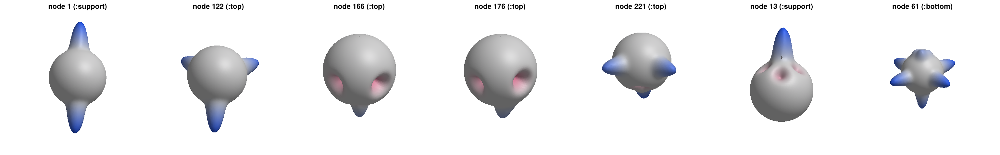

# Signatures and feature vectors

This page covers the model-facing layer: how a solved Asap `Model` becomes a
set of [`NodeSignature`](@ref)s and per-node feature vectors, what the
weighting modes mean, and how to visualize a signature. The math behind every
step is derived in [The method](method.md).

## The drivers: `HarmonicAnalysis` and `HarmonicAnalysis2d`

One call extracts every node's demands and computes its descriptor. For a 3D
structure — here the doubly-curved spaceframe from the examples, built with
Asap's `SpaceFrame` generator:

```@setup sig
using Random
Random.seed!(1)
```

```@example sig
using Asap, AsapHarmonics

section = Section(Material(200e6, 1.0, 80.0, 0.3), 1e-3)
sf = SpaceFrame(6, 1.0, 6, 1.0, 1.0, (u, v) -> 1.5 * sinpi(u) * sinpi(v), section;
    support = :corner, load = [0.0, 0.0, -20.0])
model = sf.model
solve!(model)

ha = HarmonicAnalysis(model; delta = 20, dims = 16)
```

The two keyword arguments are the method's hyperparameters:

- `delta` — the sharpness of the Gaussian force bumps (``\kappa = 2\delta``
  in the von Mises–Fisher form). Larger values make bumps approach Dirac
  spikes: descriptors then distinguish demand *directions* more finely, but
  spread energy into higher degrees. `delta = 20` is the value used
  throughout the paper.
- `dims` — the descriptor length: degrees ``l = 0`` to `dims - 1` (3D) or
  wavenumbers ``k = 0`` to `dims - 1` (2D). Because the zonal spectrum
  ``\lambda_l`` decays rapidly, 16 components capture essentially all of the
  signature's energy at `delta = 20`.

For planar (XY) trusses, [`HarmonicAnalysis2d`](@ref) is the same driver
with the circle in place of the sphere. Note the different natural scale of
its kernel parameter — a geodesic-angle standard deviation, not a chord
sharpness:

```@example sig
truss = Warren2D(11, 1.0, 1.0, section; load = [0.0, -20.0, 0.0])
ha2 = HarmonicAnalysis2d(truss.model; delta = 0.1, dims = 16)
```

Both return a [`HarmonicAnalysis`](@ref) — an immutable container holding
the per-node signatures and feature vectors (the model itself is *not*
stored):

```@example sig
ha.featurevectors[1]
```

## Anatomy of a `NodeSignature`

Each signature is the raw material of one descriptor: unit direction vectors
and signed magnitudes, one pair per force demand at the node.

```@example sig
sig = ha.signatures[1]
println(sig.index, " (", sig.id, "): ", length(sig.magnitudes), " demands")
[sig.directions sig.magnitudes]
```

The extraction rules (the sign convention of the published 3D treatment,
applied uniformly in 2D and 3D):

- **Members** contribute their signed axial force — tension positive — at
  the *outward* direction, i.e. pointing from the node along the member.
- **Applied loads** contribute their magnitude ``|P|`` at their direction
  ``\hat{P}``.
- **Reactions** (at support nodes) likewise contribute ``|R|`` at
  ``\hat{R}``, using Asap's reaction convention (elastic element forces
  accumulated at fixed DOFs).

This convention is fully rotation-equivariant: rotate the whole problem and
every signature rotates with it, leaving descriptors unchanged.

A descriptor can be computed from any single signature with
[`feature_vector`](@ref), which dispatches on the signature's dimension:

```@example sig
feature_vector(sig; delta = 20, dims = 16)
```

## Weighting modes

The `weights` keyword selects what the bumps carry — three different
questions about the same node:

```@example sig
ha_force = HarmonicAnalysis(model; weights = :force)  # the default
ha_sign  = HarmonicAnalysis(model; weights = :sign)
ha_unit  = HarmonicAnalysis(model; weights = :unit)
nothing # hide
```

- `:force` — signed axial forces / load magnitudes, as above. Descriptors
  measure the *actual demand shape*: both geometry and force intensity.
  Feature vectors scale linearly with load.
- `:sign` — magnitudes replaced by their sign (``\pm 1``). Descriptors
  measure *demand pattern* — which directions push and which pull —
  independent of intensity. Two nodes with the same connection topology and
  force senses match exactly, however different their force levels.
- `:unit` — **geometry only**: member bumps with unit weight, no load or
  reaction bumps at all. This descriptor depends on nothing but node
  positions and connectivity, so it works on an *unsolved* (merely
  `process!`ed) model — and, in optimization, differentiates through
  geometry alone without a structural solve (see
  [Differentiable optimization](optimization.md)).

## Visualizing signatures

Descriptors never need a sampled signature — but pictures do. The sampled
path exists exactly for this (and for the cross-validation tests, where it
reproduces the closed forms to machine precision).

For a 3D signature, [`sampled_force_function`](@ref) evaluates the bump sum
on the standard `nlat × (2nlat - 1)` spherical grid, and
[`sphere_points`](@ref) with [`make_xsphere`](@ref) /
[`make_ysphere`](@ref) / [`make_zsphere`](@ref) give the matching Cartesian
coordinates — scale them radially by the (normalized, offset) signature and
feed the result to any surface plot:

```@example sig
F = sampled_force_function(sig; delta = 20, nlat = 91)   # 91 × 181 samples
Θ, Φ = sphere_points(91)
X, Y, Z = make_xsphere(Θ, Φ), make_ysphere(Θ, Φ), make_zsphere(Θ, Φ)
size(F), extrema(F)
```

For a 2D signature, [`circular_gaussian`](@ref) samples the circular bump
sum (90 points by default). Rendered over the whole structure — signatures
drawn as radially-scaled spheres at each node — the demand landscape becomes
legible at a glance; this figure is produced by `examples/spaceframe.jl`:



!!! note "Sampled vs analytical feature vectors"
    Passing a sampled grid to `spherical_feature_vector(grid_matrix)` or a
    sampled circle to `circular_feature_vector(samples)` runs the numeric
    transform path. The numeric values match the closed forms up to sampling
    conventions — an `rfft` of an ``n``-point circular signature returns
    ``\approx n \cdot \mathrm{FV}_k`` — and exist for validation, not
    production use.

Next: turning feature vectors into engineering measures, in
[Distances, complexity, clustering](analysis.md).
