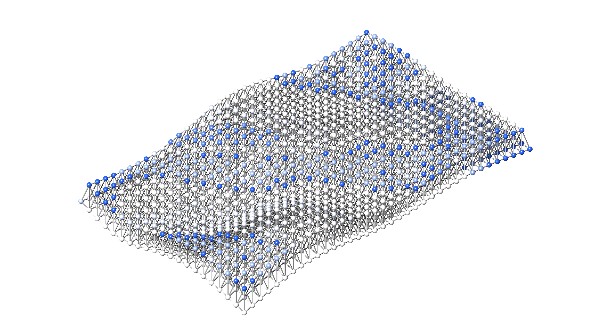

# AsapHarmonics.jl



Rotation-invariant **shape descriptors of nodal force demands** in truss
structures, built on [Asap.jl](https://github.com/keithjlee/Asap).

Every node of a solved structure carries a set of force demands: the axial
forces of its incident members, any applied loads, and (at supports) the
reaction. AsapHarmonics represents that demand set as a smooth *signature*
function — a sum of Gaussian bumps on the unit sphere (3D) or circle (2D) —
and describes it by the energy spectrum of the signature's
spherical-harmonic (3D) or Fourier (2D) expansion, **computed in closed form
from force directions and magnitudes alone**. The resulting per-node feature
vectors are:

- **exactly rotation-invariant** — two nodes with the same demand geometry in
  different orientations get the same descriptor;
- **cheap** — ``O(\text{valence}^2 \cdot \text{dims})`` per node, no grids,
  no transforms;
- **smooth** in force magnitudes *and* directions — differentiable end to
  end, which makes design-complexity **optimization** possible via
  [AsapOptim](https://github.com/keithjlee/AsapOptim).

On top of the descriptors sits an analysis layer: pairwise nodal
dissimilarity ([`distance_matrix`](@ref)), the design-complexity score of
Lee, Danhaive & Mueller (2022) ([`complexity`](@ref)), its smooth surrogate
([`soft_complexity`](@ref)), and connection standardization by clustering
([`cluster_nodes`](@ref), [`cluster_complexities`](@ref)).

## Provenance

- The 3D method implements **Lee, Danhaive & Mueller (2022)**, *Spherical
  harmonic shape descriptors of nodal force demands for quantifying spatial
  truss connection complexity*
  ([doi:10.1007/s44150-022-00021-4](https://doi.org/10.1007/s44150-022-00021-4)).
- The 2D Fourier formulation is based on chapter 4 of the author's
  dissertation; `examples/salginatobel.jl` reproduces its figure suite.
- The full mathematical derivation, with primary citations, is in
  [The method](guide/method.md) and the repository README.

## Installation

AsapHarmonics is currently **unregistered** and developed in lockstep with
its sibling repositories. Clone `Asap`, `AsapOptim`, and `AsapHarmonics` as
siblings and dev them by path:

```julia
pkg> dev ./Asap ./AsapOptim ./AsapHarmonics
```

or point a project's `[sources]` section at the local paths.

## Quick start

Descriptors come from a solved Asap model in one call. Here a planar Warren
truss, generated (and solved) by Asap's `Warren2D`:

```@example home
using Asap, AsapHarmonics

section = Section(Material(200e6, 1.0, 80.0, 0.3), 1e-3)
truss = Warren2D(11, 1.0, 1.0, section; load = [0.0, -20.0, 0.0])
model = truss.model

ha = HarmonicAnalysis2d(model; delta = 0.1, dims = 16)
```

Each node now has a 16-component rotation-invariant feature vector; the
analysis layer turns them into engineering measures:

```@example home
using LinearAlgebra

D = distance_matrix(ha)          # pairwise nodal dissimilarity
c = complexity(ha)               # design complexity (bounding-sphere radius)
s = soft_complexity(ha)          # smooth surrogate, ≤ 2c
println("complexity = ", round(c, digits = 2), ", soft complexity = ", round(s, digits = 2))
```

Clustering and low-dimensional embedding activate as package extensions:

```@example home
using Clustering                          # activates cluster_nodes
km = cluster_nodes(ha, 4)                 # 4 standardized connection groups
cluster_complexities(ha, km.assignments)  # residual complexity per group
```

For 3D spaceframes use [`HarmonicAnalysis`](@ref) (spherical harmonics)
instead of [`HarmonicAnalysis2d`](@ref) — same downstream API. For
gradient-based optimization of a design's complexity, see
[Differentiable optimization](guide/optimization.md).

## Where to go next

- [The method](guide/method.md) — what the descriptors are and why the
  closed forms are exact, end to end.
- [Signatures and feature vectors](guide/signatures.md) — building and
  inspecting nodal signatures, weighting modes, the sampled path for
  visualization.
- [Distances, complexity, clustering](guide/analysis.md) — the analysis
  layer, from dissimilarity to connection standardization.
- [Differentiable optimization](guide/optimization.md) — minimizing design
  complexity with AsapOptim + Zygote/ForwardDiff.

## Related packages

| Package | Role |
|---|---|
| [Asap.jl](https://github.com/keithjlee/Asap) | Structural analysis core: models, solve, results, generators |
| [AsapOptim.jl](https://github.com/keithjlee/AsapOptim) | Differentiable design optimization (`OptParams` → `solve_structure(x, p)`) |
