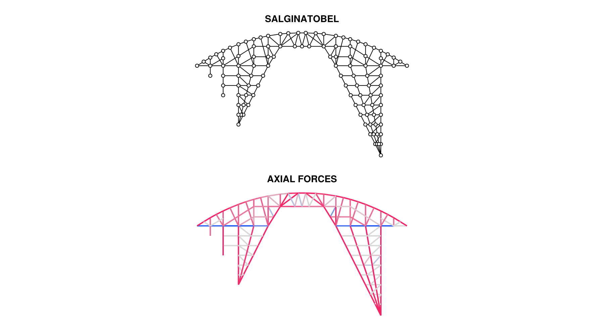
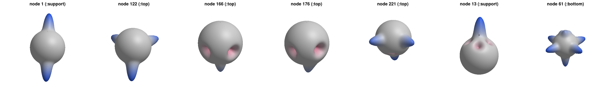
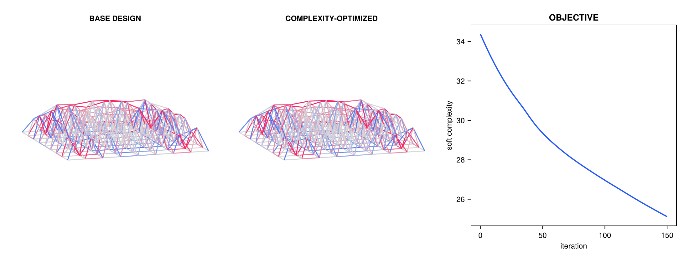

# AsapHarmonics examples

Three self-contained walkthroughs of the package. Each script runs top to
bottom and writes its figures to `figures/`:

```bash
cd examples
julia --project=. -e 'using Pkg; Pkg.instantiate()'   # once
julia --project=. salginatobel.jl
julia --project=. spaceframe.jl
julia --project=. optimization.jl
```

## `salginatobel.jl` — 2D Fourier descriptors

The complete planar pipeline on a trussed interpretation of Maillart's
Salginatobel bridge. **This example is based on chapter 4 of the author's
dissertation** (`../resources/kjl_dissertation_chapter4.pdf`) and reproduces
its figure suite: axial forces, the array of circular force signatures, the
feature-vector array, the nodal distance matrix, k-means connection clusters
with their demand-space (MDS) projection, and complexity scores per cluster
and versus the number of clusters.




Note one deliberate difference from the dissertation figures: v2 places
support reactions at the direction of the reaction itself (`|R|` at `R̂`, the
convention of the published 3D method), which is exactly rotation-equivariant.
At a support whose reaction is collinear with a lone balancing member the two
bumps cancel — such nodes plot as plain circles in the signature array.

## `spaceframe.jl` — 3D spherical-harmonic descriptors

The spatial pipeline of Lee, Danhaive & Mueller (2022) on a doubly-curved
spaceframe roof: spherical force signatures rendered as radially-offset
spheres (tension protrudes, compression indents), closed-form feature
vectors, and demand-space clustering.



## `optimization.jl` — differentiable complexity minimization

What the closed-form descriptors make possible: the smooth complexity
surrogate is differentiable through the entire chain (design vector → linear
solve → member forces → signatures → feature vectors), so the spaceframe's
shape is optimized with AsapOptim + Zygote to *reduce the variation of its
nodal force demands* — more repeatable connections for the same topology.


